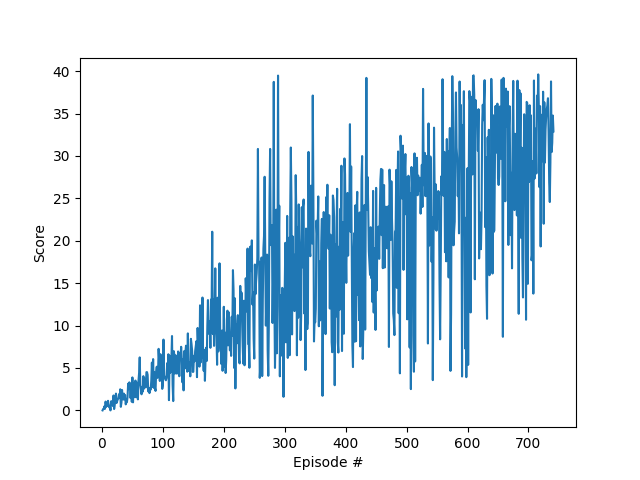

# Report

## Learning algorithm

As a learning algorithm, **Deep Deterministic Policy Gradient (DDPG)** was used. DDPG can be seen as a Deep Q-network
for continuous action spaces. It is an Actor-Critic algorithm, where the actor decides which action should be taken and 
the critic informs how good this action was. Both Actor and Critic are represented by neural networks and each of them has a copy, 
similarly as in DQN (Target Network). However, in DDPG the actor directly maps states to action instead of outputting the probability 
distribution across a discrete action space.

When it comes to exploration in continuous action spaces, we need to do it differently. For such environments
exploration is done by adding noise to the action. In the DDPG paper, authors have used Ornstein-Uhlenbeck process
and the same method was implemented in this project. Changing parameters like `mu`, `theta`, `sigma` affects
exploration of the algorithm. 

### Hyperparameters

Following values of hyperparameters were chosen:
- max_t: 1500
- actor_lr: 2e-4
- critic_lr: 2e-4
- weight_decay: 0
- buffer_size: int(1e7)
- batch_size: 256
- gamma: 0.99
- tau: 1e-3
- mu: 0.
- theta: 0.15
- sigma: 0.1
- fc1_units=256
- fc2_units=128

## Plot of rewards

- **One Agent** - In order to solve the first version of environment, agent must receive an average reward (over 100 episodes)
of at least +30. DDPG was able to solve the environment in 641 episodes, receiving average score equal to 30.02. Plot of the
rewards can be found below.

I was able to solve the environment quicker than 641 episodes with use of this [code](https://github.com/udacity/deep-reinforcement-learning/blob/master/ddpg-pendulum/ddpg_agent.py).
I did not change anything, just copied the code and ran it in my virtual machine - the agent needed only 137 episodes. 
I found it strange that the same code and the same hyperparameters resulted in different average scores. Moreover, I managed
to solve the One Agent environment only after setting `seed` in UnityEnvironment method to `2`.

## Ideas for future work
- Improving DDPG via **Prioritized Experience Replay**
- Using **Twin-Delayed DDPG (TD3)**, which introduces double learning technique to DDPG and avoids overestimation of Q-values.